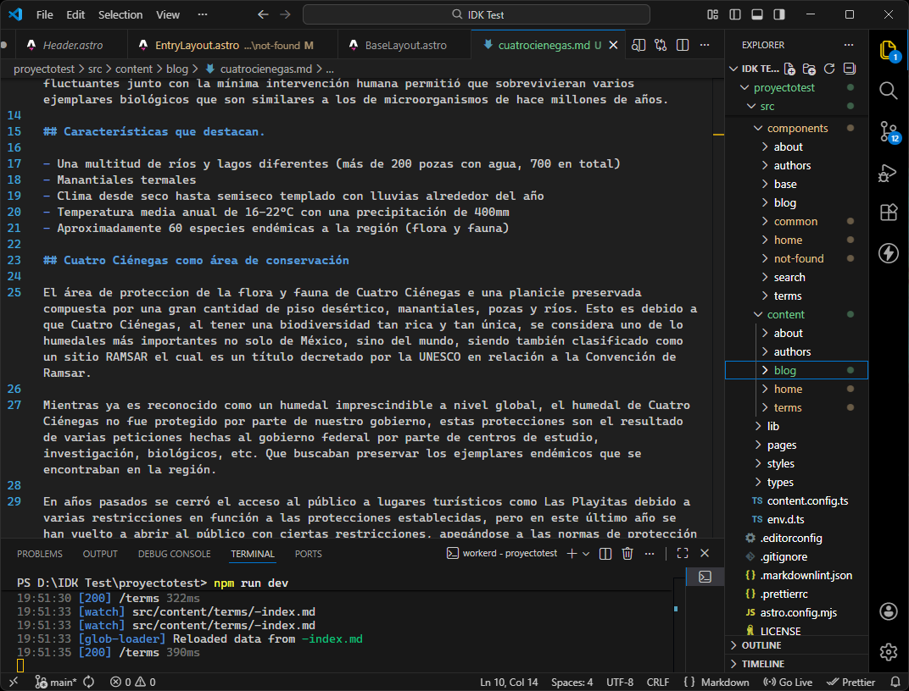
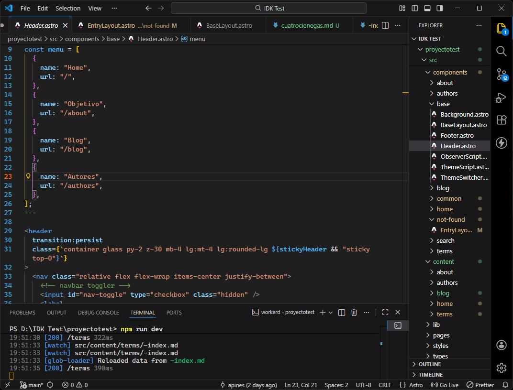
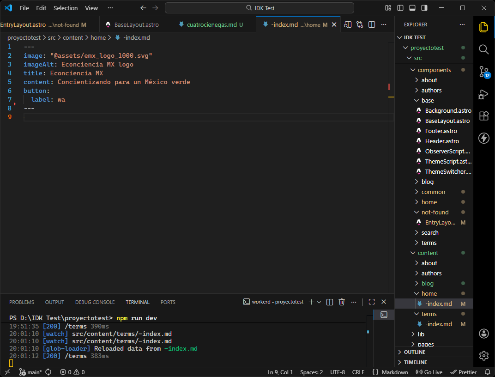

## Autor/Desarrollador

Alejandro Piñeyro Farías

### Desarrollo del proyecto

```md
Econciencia MX fue desarrollado desde un punto de vista práctico y moderno. Ahora en día la información y, en particular, la propagación de esta, se maneja a través de internet, redes sociales y páginas web. Mientras que es sencillo desarrollar una campaña de concientización en una área definida con imprimir cartelones e ir marchando por las calles, esto generalmente causa mucho discomfort para la gente y para nuestro entorno, ya que dichas impresiones generalmente terminan como otro pedazo de papel en el suelo.

Gracias al progreso de la tecnología en los años recientes, casi cualquier persona puede acceder a un sitio web, por lo que es aún más facil proporcionar información si se facilitan datos verídicos y digeridos en un formato ya conocido, como un "Blog". Mas aparte, al integrar vínculos para compartir con redes sociales, se facilita el difundir nuestro contenido a través de ellas mismas.

El proyecto se basó en el framework Astro, utilizando Javascript, Typescript, React y SCSS para su desarrollo. Se prefirió este framework por cómo facilita el enrutamiento de páginas entre sí.
```

### Content





## Terms

1. This site includes matters of opinion and speculation. All material is provided for informational purposes only.
2. While I try to keep materials up-to-date and accurate, the currency, accuracy, and completeness of my work can not be guaranteed.
3. You are responsible for whatever happens as a result of you reading or using materials from this site.
4. These terms and conditions may be amended at any time in the future.

## Attributions

This source code is derivative of [Astrogon](https://github.com/astrogon/astrogon) by [Reed Nelson](https://github.com/reednel), which uses the license below.

```md
The MIT License (MIT)

Copyright (c) 2025 Reed Nelson

Permission is hereby granted, free of charge, to any person obtaining a copy
of this software and associated documentation files (the "Software"), to deal
in the Software without restriction, including without limitation the rights
to use, copy, modify, merge, publish, distribute, sublicense, and/or sell
copies of the Software, and to permit persons to whom the Software is
furnished to do so, subject to the following conditions:
The above copyright notice and this permission notice shall be included in all
copies or substantial portions of the Software.
THE SOFTWARE IS PROVIDED "AS IS", WITHOUT WARRANTY OF ANY KIND, EXPRESS OR
IMPLIED, INCLUDING BUT NOT LIMITED TO THE WARRANTIES OF MERCHANTABILITY,
FITNESS FOR A PARTICULAR PURPOSE AND NONINFRINGEMENT. IN NO EVENT SHALL THE
AUTHORS OR COPYRIGHT HOLDERS BE LIABLE FOR ANY CLAIM, DAMAGES OR OTHER
LIABILITY, WHETHER IN AN ACTION OF CONTRACT, TORT OR OTHERWISE, ARISING FROM,
OUT OF OR IN CONNECTION WITH THE SOFTWARE OR THE USE OR OTHER DEALINGS IN THE
SOFTWARE.
```
